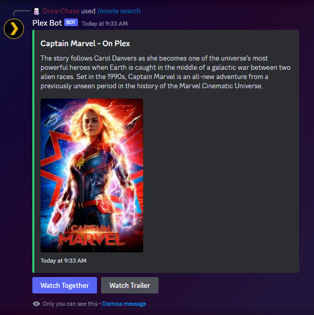

# Overview
A discord bot to add tv shows and movies to plex using sonarr and radarr 
# Commands
`/movie|tv search {query}`  
Example: `/movie search Captain Marvel`  
Response:    


### Watch Trailer


# Settings
Path: `{application directory}/data/config/settings.json`  
```json
{
  "DiscordToken": "",
  "TMDbToken": "",
  "Plex": {
    "Host": "http://127.0.0.1",
    "Port": 32400,
    "Token": ""
  },
  "Radarr": {
    "Host": "http://127.0.0.1",
    "LanguageProfileId": 1,
    "Port": 8310,
    "QualityProfileId": 1,
    "RootFolderPath": "",
    "Token": ""
  },
  "SabNZBD": {
    "Host": "http://127.0.0.1",
    "Port": 8080,
    "Token": ""
  },
  "Sonarr": {
    "Host": "http://127.0.0.1",
    "LanguageProfileId": 1,
    "Port": 8989,
    "QualityProfileId": 1,
    "RootFolderPath": "",
    "Token": ""
  }
}
```